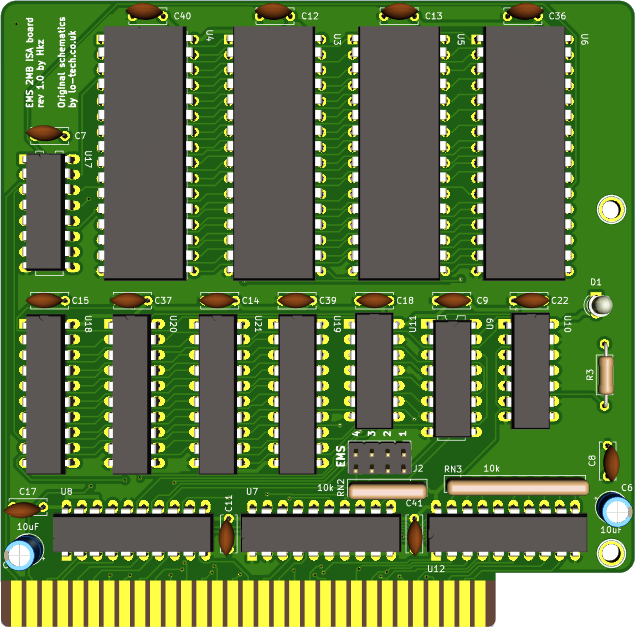

# ISA 2Mb EMS Expansion

## Introduction

This is a reimplementation of the **lo-tech.co.uk** [2Mb ISA EMS board](https://www.lo-tech.co.uk/wiki/Lo-tech_2MB_EMS_Board) with the following changes:

- All thru-hole instead of SMD, while retaining a rather compact format
- Activity led to indicate when the memory is accessed



### Disclaimer

I take NO responsibility for what happens if you decide to build and use this card. Your computer might crash, catch fire or be destroyed in other nasty ways.
Also, as this card is mostly based on the work of others, You're encourauged to take what you deem fit from this, and use it in your projects!

Additionally, do **NOT CONTACT lo-tech.co.uk FOR SUPPORT**, while this board is derived from their work, it is not their product, please do not waste their time.

## Configuration

### EMS

To configure the EMS, jumpers on J2 header are used.

Pins 1 and 2 configure the Page Frame base address, while 3 and 4 configure the IO Port base address.

```text

EMS Page Frame Base
 1 | 2 | Base  |
---+---+-------+
 X | X | C000h |
---+---+-------+
   | X | D000h |
---+---+-------+
 X |   | E000h |
---+---+-------+
   |   | Inval |
---+---+-------+

EMS IO Port Base
 3 | 4 |   Base     |
---+---+------------+
 X | X |  260-263h  |
---+---+------------+
   | X |  264-267h  |
---+---+------------+
 X |   |  268-26Bh  |
---+---+------------+
   |   |  26C-26Fh  |
---+---+------------+

```

## Usage

You need a **memory manager** to use this board. I'm including the `LTEMM` driver provided by lo-tech in this repository. Please refer to [this](https://www.lo-tech.co.uk/wiki/Terms_and_Conditions) page regarding the terms of use.

## Bill of Materials

All ICs are in DIP package.

- U7, U8: 74HCT688
- U3, U4, U5, U6: AS6C4008 (You don't need to fill all sockets: fit as much memory as you need starting from socket 1!)
- U11: 74HC04 (HCT is fine too)
- U9: 74HCT139
- U10: 74HCT32
- U12: 74LS245 (You can substitude this for an HCT/ACT/F/ALS part)
- U17: 74HCT138
- U18, U19, U20, U21: 74HCT573
- RN2: res. network, 10k, bussed, 5 pins
- RN3: res. network, 10k, bussed, 9 pins.
- R3: ~470-1k resistor (depends on the type of LED mounted on D1 and desired brightness)
- D1: 3.0mm or 5.0mm LED, you can use an horizontal mount led too
- J2 2x4 2.5mm breakable header
- C5, C6: 10uF / 50v electrolytic caps
- Remaining caps: 16x 100nF, ceramic
- ISA bracket: Keystone 9202, plus screws. You will have to cut a hole for the LED.

## Known Issues

I have received reports of this board being unstable when used with some homebrew PC clones, reports included the Xi8088 and NuXT. I have noted similar issues on a Micro8088. On the other hand, an all-CMOS board was tested fine on multiple AT clones I have.
Replacing the following ICs with ones from the TTL family solved the issue for me: U7, U8, U9, U10, U11, U12.

Note that, for increased stability, I use an ISA terminator with these homebrew computers.

## Credits

- Thanks to [lo-tech.co.uk](https://www.lo-tech.co.uk/) for having published their schematics
- Thanks to [Sergey](http://www.malinov.com/Home/sergeys-projects) for all his projects!

